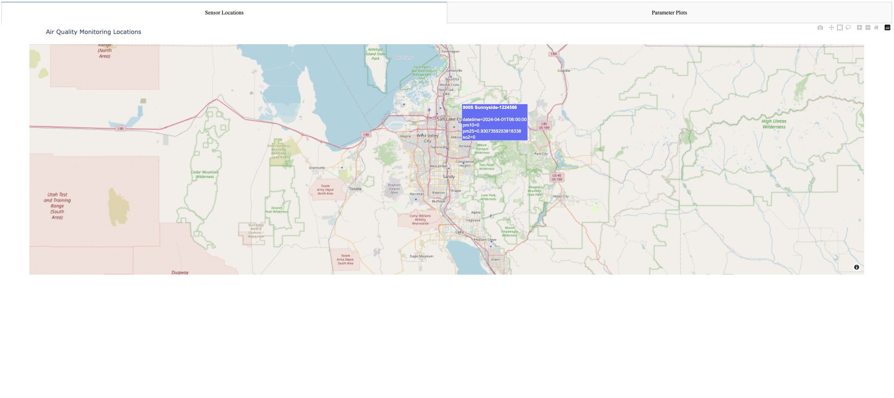
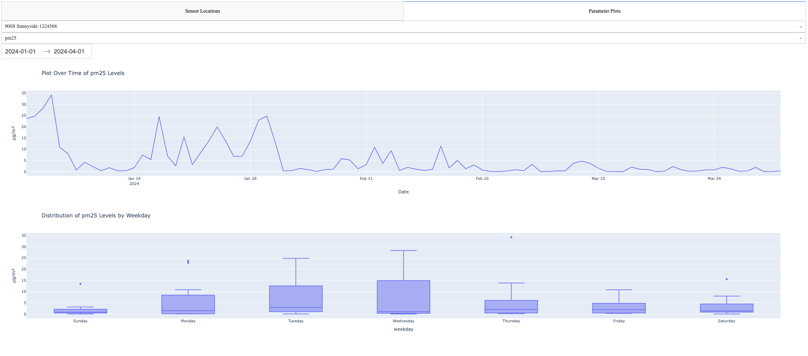

# Air Quality Monitoring Dashboard 🌍

This simple project is an interactive web-based dashboard for monitoring and analyzing air quality data. It uses data from air quality sensors and allows users to visualize parameter trends, sensor locations, and distributions across time periods. The project is built with Python, Dash, and DuckDB, and it integrates dynamic filtering, aggregation, and visualization of air quality metrics.

---




---

## Features ✨

- **Sensor Location Map:** Visualize sensor locations on an interactive map with parameter information.
- **Parameter Trend Plots:** View line and box plots for selected air quality parameters.
- **Dynamic Filtering:** Filter data by location, parameter, and date range.
- **Daily Statistics:** Aggregates daily statistics for air quality parameters.
- **Efficient Data Management:** Uses DuckDB for high-performance querying and storage.

---

## Prerequisites 🛠️

Ensure you have the following installed:

- Python 3.13.0
- DuckDB
- Required Python libraries (see `requirements.txt`)
- Air quality data in the specified schema

---

## Project Structure 🗂️

```
.
├── pipeline/                     # Scripts for data ingestion, transformation, and management
│   ├── extraction.py             # Extracts data from source files and populates the database
│   ├── transformation.py         # Handles data transformation and processing
│   ├── database_manage.py        # Utilities for database setup and teardown
├── sql/                          # SQL scripts for database operations
│   ├── ddl/                      # Schema definitions
│   ├── dml/                      # Data manipulation scripts
├── dashboard/                    # Dashboard application
│   ├── app.py                    # Main Dash application
├── notebooks/                    # Dashboard application
│   ├── api_exploration.ipynb     # API exploration & Creating new location info
│   ├── data_quality_check.ipynb  # Data quality checking (Simple Analysis)
│   ├── s3_exploration.ipynb      # S3 exploration
├── README.md                     # Project documentation
├── requirements.txt              # Python dependencies
└── locations.json                # Location configuration for air quality sensors
```

---

## Installation 🖥️

1. Clone the repository:

   ```bash
   git clone <repository_url>
   cd <repository_directory>
   ```

2. Install the required Python dependencies:

   ```bash
   pip3 install -r requirements.txt
   ```

3. Set up the database:

   ```bash
   python3 pipeline/database_manager.py --create --database-path ./air_quality.db --ddl-query-parent-dir ./sql/ddl
   ```

4. Populate the database with air quality data:

   ```bash
   cd pipeline
   python3 pipeline/extraction.py \
       --locations_file_path ./locations.json \
       --start_date 2024-01 \
       --end_date 2024-12 \
       --database_path ./air_quality.db \
       --extract_query_template_path ./sql/dml/raw/0_raw_air_quality_insert.sql \
       --source_base_path s3://openaq-data-archive/records/csv.gz
   ```

5. Apply data transformations:

   ```bash
   cd ..
   python3 pipeline/transformation.py --database_path ./air_quality.db --query_directory ./sql/dml/presentation
   ```

---

## Usage 🚀

1. Start the dashboard application:

   ```bash
   python3 dashboard/app.py
   ```

2. Open your browser and navigate to:

   ```
   http://127.0.0.1:8050
   ```

3. Interact with the dashboard:

   - **Sensor Locations Tab:** View sensor locations on an interactive map.
   - **Parameter Plots Tab:** Filter and view line and box plots of air quality data.

---

## Database Schemas 🗄️

### Raw Data Schema (`raw.air_quality`):

|---------------------|-----------|----------------------------------------------------|
| Column              | Type      | Description                                        |
|---------------------|-----------|----------------------------------------------------|
| location_id         | BIGINT    | Unique identifier for the location                 |
| sensors_id          | BIGINT    | Identifier for the sensor                          |
| location            | VARCHAR   | Name or description of the location                |
| datetime            | TIMESTAMP | Timestamp of the measurement                       |
| lat                 | DOUBLE    | Latitude of the location                           |
| lon                 | DOUBLE    | Longitude of the location                          |
| parameter           | VARCHAR   | Air quality parameter (e.g., PM10, SO2)            |
| units               | VARCHAR   | Units of measurement                               |
| value               | DOUBLE    | Measured value                                     |
| month               | VARCHAR   | Month of the measurement                           |
| year                | BIGINT    | Year of the measurement                            |
| ingestion_datetime  | TIMESTAMP | Timestamp when the data was ingested               |
|---------------------|-----------|----------------------------------------------------|

### Presentation Views:

1. **`presentation.air_quality`**:
   - Provides deduplicated, filtered data from the raw schema.

2. **`presentation.latest_param_values_per_location`**:
   - Displays the latest parameter values for each location.

3. **`presentation.daily_air_quality_stats`**:
   - Aggregates daily statistics for each parameter and location.

---

## Key Files 📁

- **`pipeline/extraction.py`**: Extracts raw air quality data from source files.
- **`pipeline/transformation.py`**: Transforms and processes data for reporting.
- **`dashboard/app.py`**: The Dash application for data visualization.

---

## Contributing 🤝

Feel free to open issues or submit pull requests to improve the project. Contributions are welcome!

---

## License 📜

This project is licensed under the MIT License. See the `LICENSE` file for details.

---

## Acknowledgments 🌟

- [OpenAQ](https://openaq.org/) for the data.
- Dash and Plotly for the visualization framework.
- DuckDB for fast in-process querying.
- This project was inspired by tutorials and resources from [TrentDoesMath](https://www.youtube.com/watch?v=3gZickVbFfw&list=PLjWBnQvWCMLqtgQKraBXSuPBuXlxPuVdG&ab_channel=TrentDoesMath). Their guidance on ETL pipelines helped shape this implementation.

---

## Future... 🔮

- Using learned technologies, I will create an ‘flight ticket price prediction site'.
